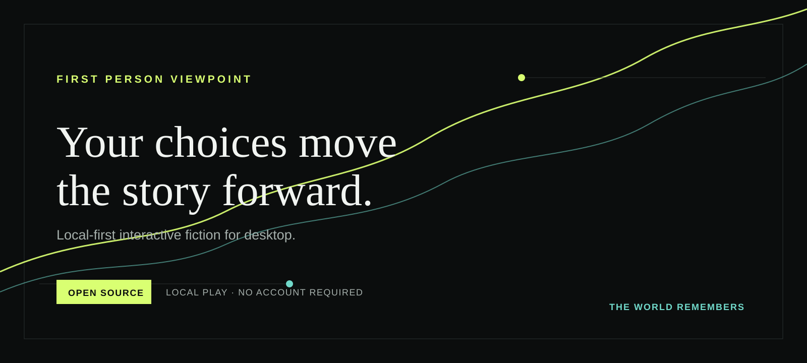

<div align="center">
  

  # First Person Viewpoint

  **Your choices move the story forward. The world remembers.**

  A free, local-first desktop app for AI-driven interactive fiction.

  [](LICENSE)
  
  
  
</div>



## What is FPV?

**First Person Viewpoint (FPV)** lets you inhabit the protagonist of an evolving story. Build or choose a world, write what you do or say, and let the narrator carry the scene forward. Characters, locations, inventory, relationships, and consequences persist between turns.

FPV is built around ownership: your stories live on your computer, local play needs no account, and the source is available under **AGPL-3.0-or-later**.

| You bring | FPV carries forward |
| --- | --- |
| An action, line of dialogue, or direction | A narrated response in the world’s voice |
| A world, character, or rule | Persistent lore, relationships, quests, and facts |
| A choice | Consequences that can matter many scenes later |

## Why local-first?

- **No account for local play** — no subscription, license server, or story-credit system.
- **Your data stays yours** — worlds, sessions, story state, and provider credentials remain on your machine.
- **Bring your own model** — run narration with Ollama and illustrations with stable-diffusion.cpp locally.
- **Cloud is optional** — supported narration and image providers use your own API key; keys are stored locally.
- **Move or inspect your work** — export and restore a project, then inspect the source that runs it.

## Release status

| Platform | Source | Download |
| --- | --- | --- |
| **macOS** | Included | [v1.0.0 — Apple Silicon DMG](https://github.com/lumizone/FPV/releases/tag/v1.0.0), Developer ID signed; notarization pending |
| **Windows** | Included | [v1.0.0 — x64 NSIS installer](https://github.com/lumizone/FPV/releases/tag/v1.0.0), unsigned |

Both platform installers and their SHA-256 manifests are published in GitHub Releases. The macOS artifact may require a manual Gatekeeper approval until notarization is added.

## Included in the source

- Local Ollama narration
- Local stable-diffusion.cpp image generation
- SQLite worlds, sessions, story state, and continuity
- Project export and restore
- Optional BYOK cloud narration and image providers
- Seven interface locales: English, Polish, German, Spanish, Japanese, Korean, and Chinese

## Repository layout

```text
FPV/
├── mac-version/      # macOS Tauri application
├── windows-version/  # Windows Tauri application
└── LICENSE           # AGPL-3.0-or-later
```

Both platform apps use **Tauri 2**, **Rust**, **React**, **TypeScript**, **Vite**, **SQLite**, **Ollama**, and **stable-diffusion.cpp**.

## Run it from source

### Prerequisites

- Node.js and npm
- Rust toolchain
- Platform-native build dependencies for Tauri
- Native runtime binaries fetched or built for your platform — these are deliberately not committed

### macOS

```bash
cd mac-version
npm install
npm run qa
npm run build
```

For a native package, fetch the pinned Ollama runtime first. `scripts/fetch-binaries.sh` validates the download; it also expects a separately verified `sd-cli` binary through `FPV_SD_CLI_SOURCE` and `FPV_SD_CLI_SHA256`.

### Windows

```bash
cd windows-version
npm install
npm run qa
npm run build
```

Windows packaging requires a Windows release environment. The bundled runtimes are downloaded during its packaging workflow and are not versioned in Git.

## Security and distribution

Never commit `.env` files, Apple signing credentials, provider API keys, or downloaded runtime binaries. The root `.gitignore` excludes them by default.

The macOS v1.0.0 artifact is Developer ID signed but not notarized/stapled yet; Gatekeeper may ask for manual approval. The Windows v0.1.0 installer is unsigned; Windows signing is planned for a later release.

## License

FPV is licensed under the [GNU Affero General Public License v3.0 or later](LICENSE).
